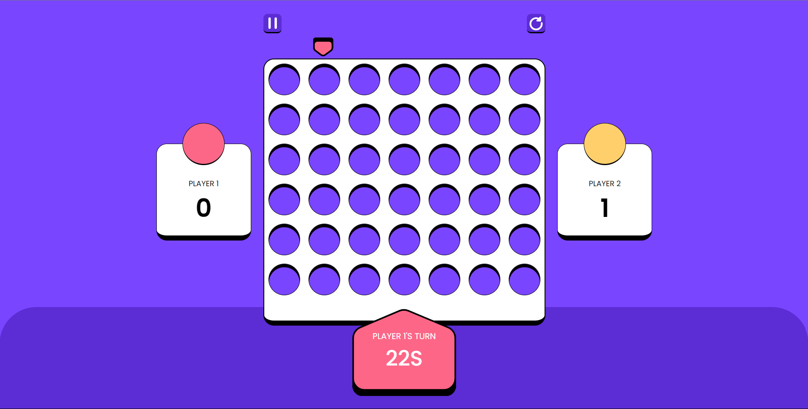

# Connect four game - vanilla JavaScript

This repository contains a web-based implementation of the classic Connect Four game built entirely with HTML, CSS, and JavaScript. No additional frameworks or libraries are used.

## How to Play

BE THE FIRST PLAYER TO CONNECT 4 OF THE SAME COLORED DISCS IN A ROW.

my portfolio: [idriss.douiri.org](https://idriss.douiri.org)
